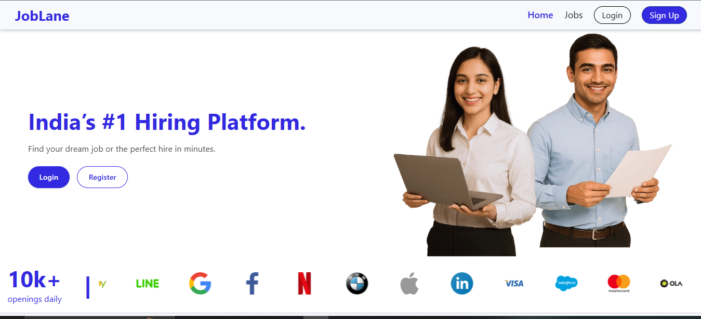
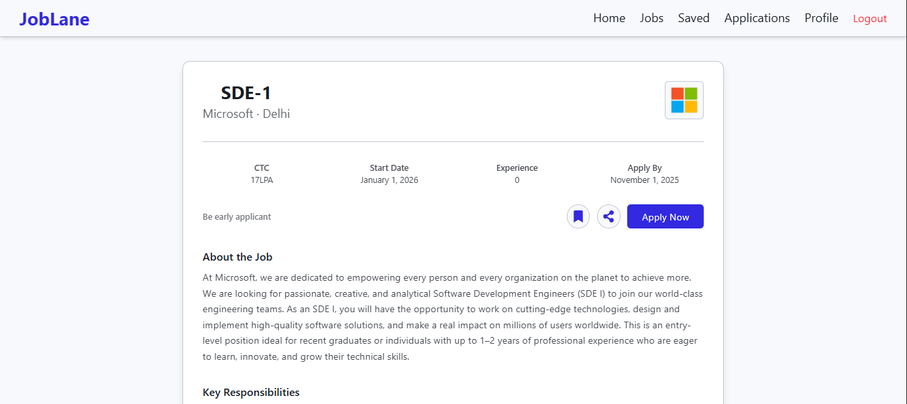
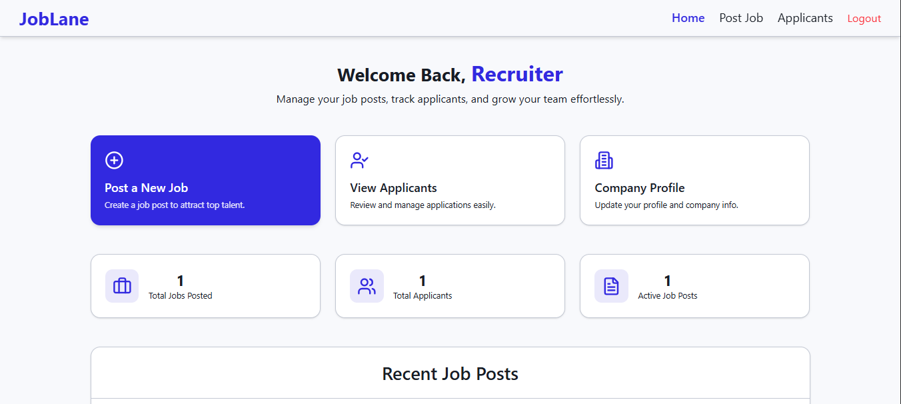
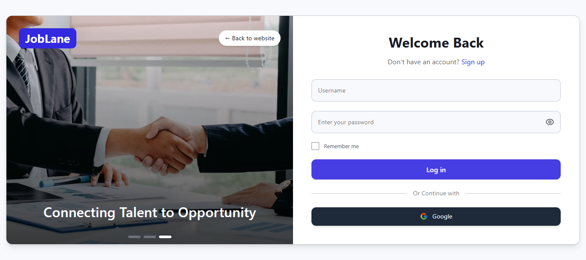

# JobLane Frontend

**JobLane** is India’s #1 Hiring Platform built using **React.js** and **Tailwind CSS**. This repository contains the frontend codebase that allows job seekers and recruiters to seamlessly interact with the platform.

JobLane is a full-stack job hiring platform that connects job seekers with recruiters across India. It features secure authentication, role-based access, and a modern responsive UI.


## Features

- Responsive and modern UI
- JWT & Google OAuth authentication
- Job search, filtering, and application
- Recruiter dashboard to post/manage jobs
- View applicants and success stories

## Tech Stack

- React.js
- Tailwind CSS
- React Router
- Axios
- Google OAuth (`@react-oauth/google`)

##  Live Demo

Frontend: [https://joblane-frontend.vercel.app/](https://joblane-frontend.vercel.app/)  
Backend API: [https://joblane-backend-0eqs.onrender.com/](https://joblane-backend-0eqs.onrender.com/)

## Setup Instructions

```bash
git clone https://github.com/vishal-singh-code/joblane-frontend.git
npm install
npm run dev
```

## Project Structure
```
src/
├── api/
├── assets/
├── components/
├── contexts/
├── data/
├── pages/
├── routes/
├── App.jsx
└── index.css

```

## Screenshots

### Landing Page


### Job Listings


### Job Details


### Recruiter Dashboard


### Login



##  Contributing

Contributions, issues, and feature requests are welcome!  
Feel free to open an issue or submit a pull request.
