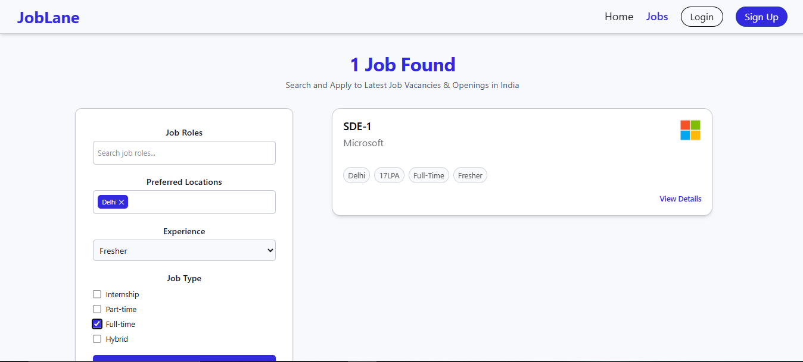

# JobLane Frontend

**JobLane** is a modern, full-stack job hiring platform frontend built with React.js and Tailwind CSS, designed to connect job seekers and recruiters through a seamless, secure, and responsive user experience.

This repository contains the frontend codebase of JobLane, focusing on scalability, clean UI, and real-world hiring workflows.


## Key Highlights

- Role-based access (Job Seeker, Recruiter, Admin)
- JWT-based authentication with Google OAuth integration
- Email-based OTP verification
- Protected routes using React Router
- Centralized API handling using Axios with interceptors
- Resume upload & saved jobs functionality
- Fully responsive UI using Tailwind CSS
- Production-ready deployment with Vercel

## Features

### Job Seekers
- Browse and search job listings
- Filter jobs based on criteria
- Apply for jobs with resume upload
- Save jobs for later
- View detailed job descriptions

### Recruiters
- Recruiter-specific dashboard
- Post and manage job listings
- View applicants for posted jobs
- Role-based access control

### Admin
- Admin analytics dashboard (backend-powered)
- Platform-level monitoring and management

### Authentication & Security
- JWT authentication for secure sessions
- Google OAuth login using `@react-oauth/google`
- Email-based OTP verification
- Protected routes and authorization handling

## Tech Stack
- **React.js** – Component-based UI
- **Tailwind CSS** – Utility-first styling
- **React Router** – Client-side routing
- **Axios** – API communication
- **Google OAuth** – Social authentication

##  Live Demo

Frontend: [https://joblane-frontend.vercel.app/](https://joblane-frontend.vercel.app/)  
Backend API: [https://joblane-backend-0eqs.onrender.com/](https://joblane-backend-0eqs.onrender.com/)

*The backend is built using Django REST Framework with JWT authentication.*


## Project Structure
```
src/
├── api/          # Axios instances & API services
├── assets/       # Static assets
├── components/   # Reusable UI components
├── config/       # Backend Endpoints
├── contexts/     # Global state & auth context
├── data/         # Static and mock data
├── pages/        # Application pages
├── routes/       # Route definitions & protected routes
├── App.jsx       # Root component
└── index.css     # Global styles
```

## Setup Instructions

### Prerequisites
- Node.js (v16+ recommended)
- npm or yarn

### Installation
```bash
git clone https://github.com/vishal-singh-code/joblane-frontend.git
cd joblane-frontend
npm install
npm run dev
```
The application will run on:  
http://localhost:5173

## Screenshots
Below are some key UI screens from the JobLane frontend.

### Landing Page


### Job Listings


### Job Details


### Login


### Recruiter Dashboard


## Future Enhancements
- AI-based job recommendation system
- Resume parsing & skill extraction
- Real-time notifications
- Advanced recruiter analytics

##  Contributing

Contributions are welcome!  
If you’d like to improve this project:
1. Fork the repository
2. Create a new feature branch
3. Commit your changes
4. Open a pull request
